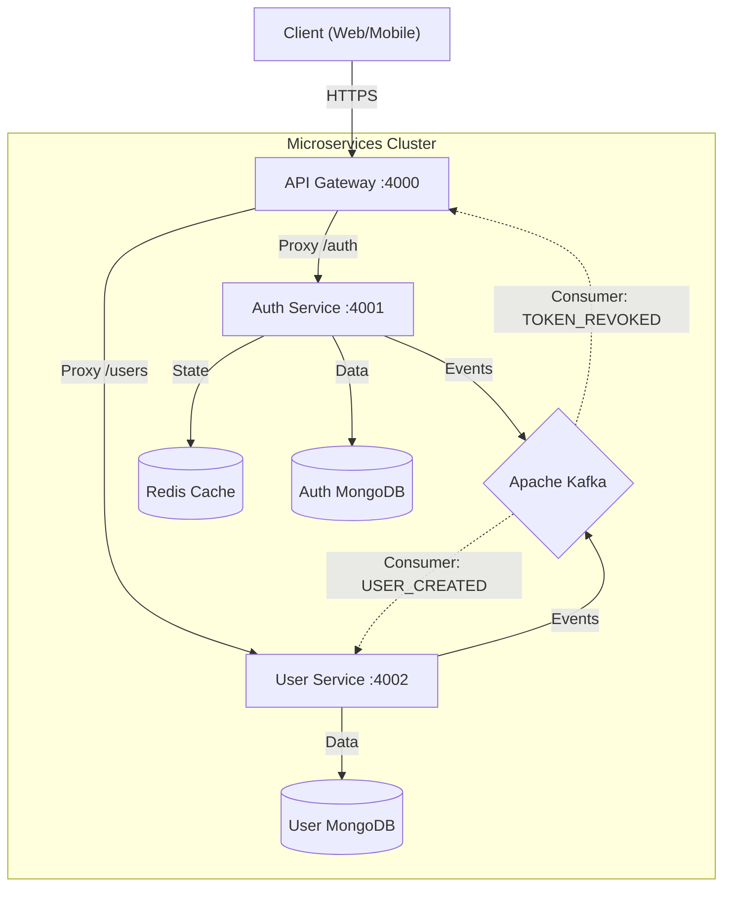

# 🛡️ Enterprise-Grade Microservices Authentication System

> **A robust, event-driven microservices architecture built with Node.js, TypeScript, Kafka, and Docker.**  
> *Designed for scalability, security, and high availability.*

---

## 📖 Project Overview

This project demonstrates a production-ready authentication system decomposed into microservices. Unlike monolithic auth apps, this system uses an **API Gateway** to route traffic, **Apache Kafka** for asynchronous event propagation (e.g., data consistency, token revocation), and **Redis** for high-performance caching and state management.

Key engineering highlights:
- **Event-Driven Architecture**: Decoupled services communicating via Kafka topics (`user.events`, `auth.events`).
- **Security-First Design**: Implements **Refresh Token Rotation** with reuse detection (automatic family revocation) to prevent token theft replay attacks.
- **Database-per-Service**: Strict data isolation with dedicated MongoDB instances for Auth and User services.
- **Infrastructure as Code**: Fully containerized with Docker Compose for one-command startup.

---

## 🏗️ System Architecture

The system follows the **API Gateway pattern**, serving as the single entry point for all client requests, routing them to the appropriate backend service.



---

## 🔄 Core Microservices

### 1. **API Gateway** (`/services/api-gateway`)
- **Role**: Entry point, Reverse Proxy, Rate Limiting.
- **Stack**: Express, `express-http-proxy`.
- **Key Logic**: Dispatches requests to internal services. Handles centralized CORS and rate limiting protection against DDoS.

### 2. **Auth Service** (`/services/auth-service`)
- **Role**: Identity Provider (Signup, Login, Token Management).
- **Stack**: TypeScript, JWT, Redis, MongoDB.
- **Key Logic**: 
    - Issues short-lived **Access Tokens** (15m) and sliding-window **Refresh Tokens** (7d).
    - **Token Rotation**: Every refresh uses a new token. If an old token is reused, the entire token family is revoked (security against theft).
    - Publishes `USER_CREATED` events to Kafka so the User Service can create a profile asynchronously.

### 3. **User Service** (`/services/user-service`)
- **Role**: Profile Management.
- **Stack**: TypeScript, MongoDB, Kafka Consumer.
- **Key Logic**: 
    - Consumes `USER_CREATED` events to generate user profiles independently.
    - Manages user data updates.
    - Demonstrates **Eventual Consistency** patterns.

---

## 🔐 Security Features Breakdown

| Feature | Implementation Details |
|---------|------------------------|
| **Token Rotation** | Refresh tokens change on every use. Old tokens are blacklisted in Redis. |
| **Reuse Detection** | If a hacker tries to use a stolen (old) refresh token, the system detects the anomaly and revokes *all* tokens for that user immediately. |
| **Event-Driven Revocation** | When a user logs out, a Kafka event propagates the revocation to ensuring session termination across services. |
| **HttpOnly Cookies** | Refresh tokens are stored in `HttpOnly` `Secure` cookies to prevent XSS attacks. |
| **Rate Limiting** | `express-rate-limit` protects sensitive endpoints (Login, Signup) from brute-force attacks. |

---

## 🚀 Getting Started

### Prerequisites
- Docker & Docker Compose
- Node.js v18+ (for local testing scripts)

### Installation & Run

1. **Clone the repository**:
   ```bash
   git clone <repo-url>
   cd node-auth-app
   ```

2. **Start Infrastructure**:
   Spins up MongoDB, Redis, Kafka, Zookeeper, and all Microservices.
   ```bash
   docker-compose up --build
   ```

3. **Verify Services**:
   - **API Gateway**: `http://localhost:4000`
   - **Auth Service**: `http://localhost:4001`
   - **User Service**: `http://localhost:4002`

---

## 🧪 Testing & Verification

The project includes a comprehensive **End-to-End System Test** script that simulates a real user journey.

### Run System Test
```bash
node test-system.js
```
**What this test covers**:
1. **Signup**: Registers a user via Gateway -> Auth Service.
2. **Kafka Propagation**: Verifies User Service creates the profile via Kafka event.
3. **Login**: Authenticates and retrieves tokens (handling 403 blocks automatically).
4. **Token Rotation**: Uses the Refresh Token to get a new Access Token.
5. **Profile Update**: Modifies user data via User Service.
6. **Logout**: Revokes session.

---

## 🛠️ Technology Stack

- **Runtime**: Node.js
- **Language**: TypeScript
- **Containerization**: Docker
- **Orchestration**: Docker Compose
- **Message Broker**: Apache Kafka
- **Databases**: MongoDB (Information Storage), Redis (Session/Token Management)
- **Testing**: Jest, Custom E2E Scripts

---

## 👤 Author

**Sushil Satyarthi**  
*Full Stack Developer | Microservices Enthusiast*
